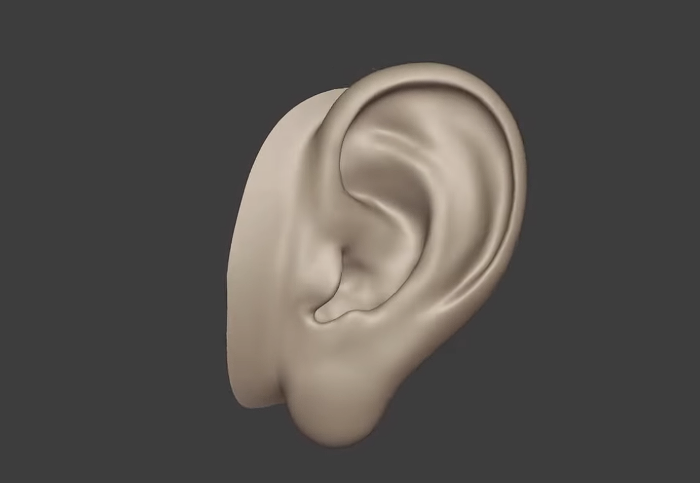

# Ear Sculpt & Retopology

> Character Art • Blender • 2026 • ~4 Hours

---

## 🎥 Demo

  <iframe
    src="https://youtu.be/eeRLTmH1D3M"
    title="Ear Sculpt & Retopology"
    style="position:absolute;top:0;left:0;width:100%;height:100%;border:0;"
    allowfullscreen>
  </iframe>

---

## 📖 Overview

A high-poly sculpt and production-ready retopology of a human ear, demonstrating anatomical understanding and clean edge flow suitable for deformation using a bone to scale and morph targets to shape within a character creator.

---

## 🛠 Skills Demonstrated

- 3D Sculpting
- Retopology
- Human Anatomy
- Quad Topology
- Edge Flow

---

## 💻 Software

- Blender
- RetopoFlow
